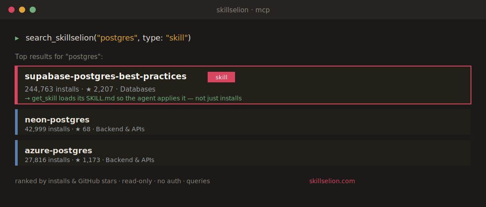

<p align="center">
  
</p>

<p align="center">
  <a href="https://github.com/skillselion/skillselion-mcp/blob/master/LICENSE"></a>
  
  = 18">
  
  <a href="https://skillselion.com"></a>
  <a href="https://github.com/skillselion/skillselion-mcp/stargazers"></a>
</p>

<p align="center">
  <b>Let your AI agent search <a href="https://skillselion.com">Skillselion</a> — a curated directory of Claude Code<br>
  agent skills, MCP servers & plugin marketplaces, ranked by installs & GitHub stars — without leaving the editor.</b>
</p>

<p align="center">
  🧩 Works with <b>Claude Code</b> · <b>Claude Desktop</b> · <b>Cursor</b> · <b>Codex</b> · and any MCP client
</p>

<p align="center">
  
</p>

---

## ✨ What it does

Skillselion indexes **83,000+** Claude Code skills, MCP servers and plugin marketplaces and ranks them by **real community signal** (installs + GitHub stars). This server puts that directory one tool-call away — so when you need "a trusted Postgres skill" or "the best code-review MCP," your agent finds it and hands you the **paste-ready install command**, without you ever opening a browser.

## 🔧 Tools

| Tool | What it does |
|------|--------------|
| 🔍 **`search_skillselion`** | Search by keyword or task (`postgres`, `code review`, `playwright`); optional `type` filter (`skill` / `mcp` / `marketplace`). Returns name, type, installs, stars, repo, an install command, and the listing URL. |
| 🏆 **`top_skillselion`** | The leaderboard — "what are the best Claude Code skills / MCP servers right now." Skills rank by installs; MCP servers & marketplaces by GitHub stars. |

> **Read-only & private.** The server only issues `GET` requests to the public Skillselion catalog API. No auth, no writes, no secrets, no telemetry.

## 🚀 Install

### Claude Code

```bash
claude mcp add skillselion -- npx -y github:skillselion/skillselion-mcp
```

### Claude Desktop / Cursor / Codex

Add this to your MCP config:

```json
{
  "mcpServers": {
    "skillselion": {
      "command": "npx",
      "args": ["-y", "github:skillselion/skillselion-mcp"]
    }
  }
}
```

> Runs straight from this repo — **no build step**. Once published to npm, plain `skillselion-mcp` (without the `github:` prefix) will work too.

## 💬 Example

> 🗣️ *"Find me a trusted Postgres skill for Claude Code."*

The agent calls `search_skillselion({ query: "postgres", type: "skill" })` and gets back the top ranked results with install commands — exactly like the card above. ⬆️

## 🛠 Development

```bash
npm install
node index.js   # speaks MCP over stdio
```

## 📄 License

[MIT](./LICENSE) © [Skillselion](https://skillselion.com)

<p align="center">
  <sub>Built for builders. Find the skill, not the noise. → <a href="https://skillselion.com">skillselion.com</a></sub>
</p>
