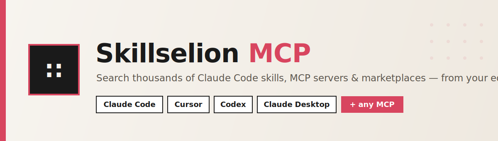
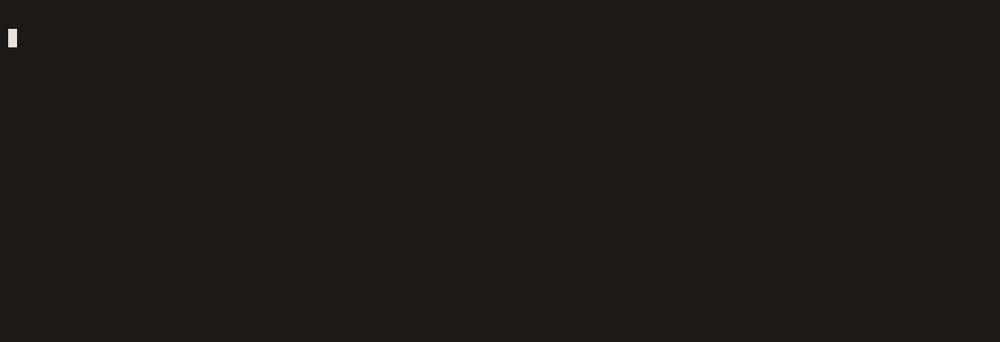

<p align="center">
  
</p>

<p align="center">
  <a href="https://github.com/skillselion/skillselion-mcp/releases"></a>
  <a href="https://github.com/skillselion/skillselion-mcp/blob/master/LICENSE"></a>
  
  = 18">
</p>

<p align="center">
  
  <a href="https://skillselion.com"></a>
  <a href="https://github.com/skillselion/skillselion-mcp/pulls"></a>
  
  <a href="https://github.com/skillselion/skillselion-mcp/stargazers"></a>
</p>

<p align="center">
  <b>Augment your coding agent with thousands of battle-tested skills.</b><br>
  It searches <a href="https://skillselion.com">Skillselion</a> — a curated directory of Claude Code skills, MCP servers & marketplaces ranked by real installs —<br>
  and pulls a skill's <b>actual instructions</b> to apply <b>mid-task</b>. So your agent works from proven patterns, not guesses.
</p>

<p align="center">
  🧩 Works with <b>Claude Code</b> · <b>Claude Desktop</b> · <b>Cursor</b> · <b>Codex</b> · and any MCP client
</p>

<p align="center">
  
</p>

<p align="center"><sub>Real run against the live catalog: <code>search_skillselion</code> → <code>load_skill</code> pulls the skill's real <code>SKILL.md</code> + bundled files into a temp folder → your agent follows it like an installed skill.</sub></p>

---

## ✨ What it does

Skillselion indexes **thousands of** Claude Code skills, MCP servers and plugin marketplaces, ranked by **real community signal** (installs + GitHub stars). This server turns that directory into a live capability for your agent: it can **search** for the right skill and **`load_skill` to dynamically load it mid-task** — the real `SKILL.md` into context, **plus any bundled scripts / references / templates materialized into a temp folder** — so it works from the skill exactly like an installed one, instead of improvising "best practices." **Find the skill → load it → follow it.**

## 🔧 Tools

| Tool | What it does |
|------|--------------|
| 🔍 **`search_skillselion`** | Search by keyword or task (`postgres`, `code review`, `playwright`); optional `type` filter (`skill` / `mcp` / `marketplace`). Returns name, type, installs, stars, repo, an install command, and the listing URL. |
| 📥 **`load_skill`** | **The dynamic load.** Pulls a skill's real **`SKILL.md`** into context **and materializes its whole directory** (scripts, references, templates) into a **temp folder**, so the agent uses it like an *installed* skill — read/run the bundled files included. Pass an `id` from search, or a `query`. |
| 🏆 **`top_skillselion`** | The leaderboard — "what are the best Claude Code skills / MCP servers right now." Skills rank by installs; MCP servers & marketplaces by GitHub stars. |

> **Read-only & private.** The server only issues `GET` requests to the public Skillselion catalog API. No auth, no writes, no secrets, no telemetry.

## 🚀 Install

### Claude Code

```bash
claude mcp add skillselion -- npx -y github:skillselion/skillselion-mcp
```

### Claude Desktop / Cursor / Codex

Add this to your MCP config:

```json
{
  "mcpServers": {
    "skillselion": {
      "command": "npx",
      "args": ["-y", "github:skillselion/skillselion-mcp"]
    }
  }
}
```

> Runs straight from this repo — **no build step**. Once published to npm, plain `skillselion-mcp` (without the `github:` prefix) will work too.

## 🪄 Skill autopilot (one-command setup)

Want your agent skill-aware **automatically**, every session? Run:

```bash
npx -y github:skillselion/skillselion-mcp setup --top 10
```

It does two things:

- **Registers the MCP globally** (`claude mcp add --scope user`) — available in every project.
- **Installs a Claude Code `SessionStart` hook** that, at the start of each session, hands your agent the **top N most-installed skills** (set with `--top`) and tells it to **`load_skill`** the matching one whenever your task calls for it — so skills get loaded **dynamically, on demand**.

So you don't have to remember the tools exist — the agent is primed to reach for (and load) proven skills on its own. Safe by design: your `~/.claude/settings.json` is **merged, never clobbered**, re-running de-dupes, and it only ever **reads** the catalog. Restart Claude Code to activate.

## 💬 Example

> 🗣️ *"Set up Postgres for this project."*

Instead of winging it, your agent:

1. `search_skillselion({ query: "postgres", type: "skill" })` → finds **supabase-postgres-best-practices** (244k installs)
2. `load_skill({ id: "skill:supabase/agent-skills#supabase-postgres-best-practices" })` → loads the real `SKILL.md` into context **and drops any bundled scripts/refs into a temp folder**
3. **follows that skill** — reading its references and running its scripts — like it was installed all along.

With the [setup hook](#-skill-autopilot-one-command-setup) above, steps 1–2 happen on their own — the agent loads the skill the moment your task calls for it. ⬆️

## 🛠 Development

```bash
npm install
node index.js   # speaks MCP over stdio
```

## 📄 License

[MIT](./LICENSE) © [Skillselion](https://skillselion.com)

<p align="center">
  <sub>Built for builders. Find the skill, not the noise. → <a href="https://skillselion.com">skillselion.com</a></sub>
</p>
